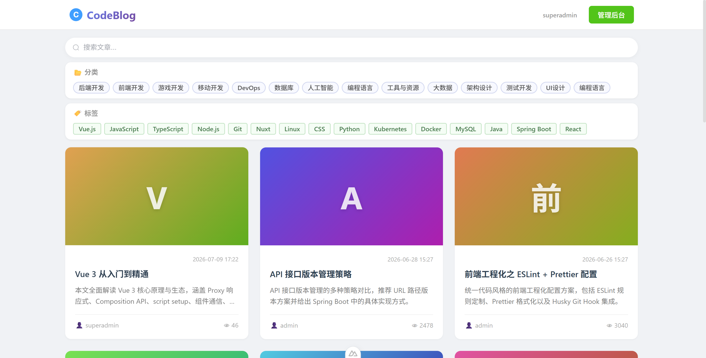
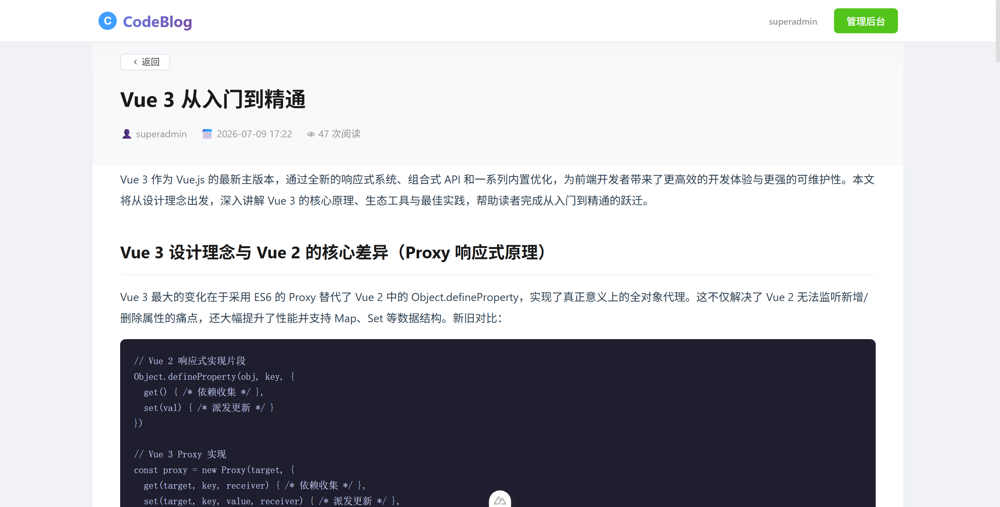
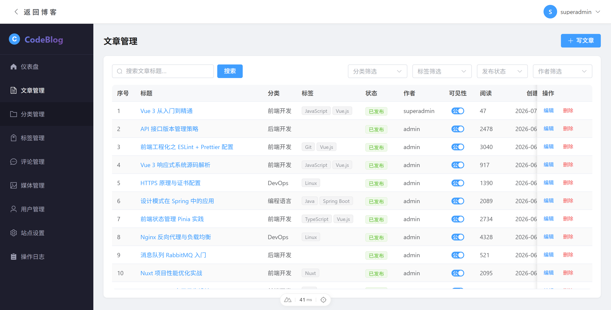
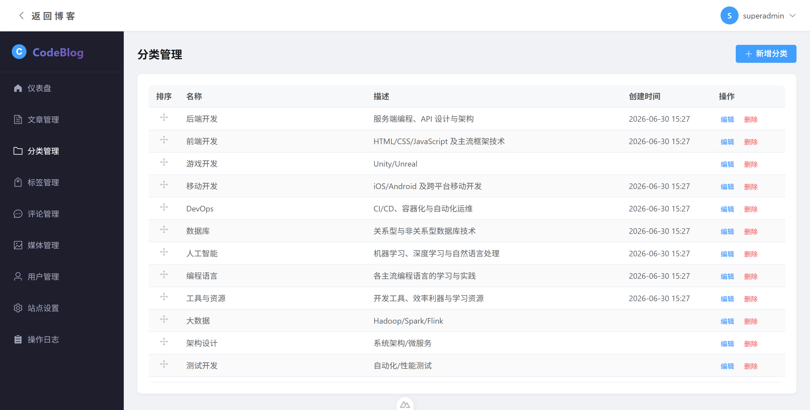
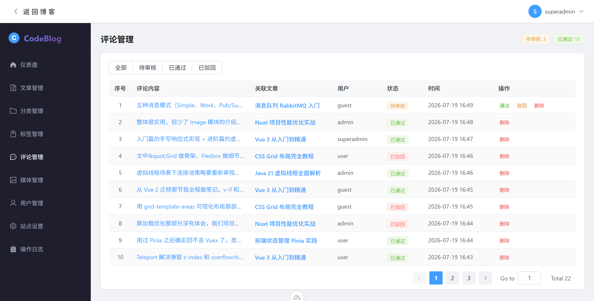
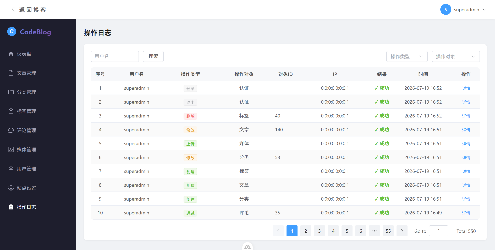

# CodeBlog — 博客内容管理系统

基于 **Nuxt 4** + **Spring Boot 3** + **MySQL** 的全栈博客 CMS 系统，支持多角色权限管理、文章/分类/标签/评论/媒体管理。

## 技术栈

### 前端 (nuxt-test/)
- Nuxt 4 + Vue 3（Composition API）
- Element Plus 组件库
- Tiptap 富文本编辑器
- SortableJS 拖拽排序
- Axios HTTP 请求

### 后端 (java-backend/)
- Spring Boot 3.4 + Java 21
- Spring Data JPA + MySQL 8
- Spring Security + JWT 无状态认证
- Maven 构建

## 快速启动（开发环境）

### 前置要求
- Java 21+
- Node.js 20+
- MySQL 8+
- Maven 3.9+

### 1. 启动后端
`bash
cd java-backend
mvn.cmd spring-boot:run
`

### 2. 启动前端
`bash
cd nuxt-test
npm run dev
`

### 3. 访问
- 前端：http://localhost:3000
- 后端 API：http://localhost:8080
- 首次访问自动跳转到初始化页面，创建超级管理员账号后即可登录使用

## 角色权限体系

| 功能模块 | SUPERADMIN | ADMIN | USER | GUEST |
|---------|:----------:|:-----:|:----:|:-----:|
| 创建文章 | ✅ | ✅ | ✅ | ❌ |
| 编辑/删除全部文章 | ✅ | ✅ | ❌ | ❌ |
| 编辑/删除自己文章 | ✅ | ✅ | ✅ | ❌ |
| 查看文章列表 | ✅ | ✅ | ✅ | ❌ |
| 分类/标签增删改 | ✅ | ✅ | ❌ | ❌ |
| 分类/标签拖拽排序 | ✅ | ✅ | ❌ | ❌ |
| 分类/标签查看 | ✅ | ✅ | ✅ | ✅ |
| 用户管理 | ✅ | ✅ | ❌ | ❌ |
| 评论管理 | ✅ | ✅ | ❌ | ❌ |
| 媒体上传 | ✅ | ✅ | ✅ | ❌ |
| 媒体删除 | ✅ | ✅ | ❌ | ❌ |
| 站点设置 | ✅ | ❌ | ❌ | ❌ |
| 操作日志 | ✅ | ✅ | ❌ | ❌ |
| 仪表盘 | ✅ | ✅ | ✅(只读) | ✅(只读) |

> 编辑和删除操作只针对下级权限用户，对同级或上级用户不生效

## 功能特性

### 博客首页
- 三列文章网格布局，每页 12 篇
- 关键词搜索、分类/标签可同时筛选
- 分类/标签折叠展开，滚动溢出自动检测
- 离开首页自动保存滚动位置，返回时恢复
- 筛选条件跨页面持久化（useState）

### 文章详情
- 返回栏 + 文章标题区固定定位（毛玻璃背景）
- 与文章内容区分割线
- 文章内容 Markdown 渲染 + 代码高亮
- 评论区组件

### 文章管理
- Tiptap 富文本编辑器
- 懒加载 + 虚拟滚动列表
- 删除文章时自动级联删除关联评论
- 页面切换回列表时自动刷新数据

### 分类 / 标签管理
- SortableJS 拖拽排序（仅管理员可见拖拽手柄），sortOrder 持久化
- 懒加载滚动，排序后表格自动刷新

### 评论管理
- 待审/已批准/已驳回三态审核流程
- 评论预览弹窗（查看详情 + 跳转关联文章）
- 表格行高紧凑优化，批量操作支持

### 操作日志
- 自动记录用户增删改查、登录退出、审批等操作
- 记录字段：操作用户、角色、操作类型、目标对象、详情、IP、路径、结果
- 支持按用户名、操作类型、目标对象筛选
- 操作类型颜色权重区分（删除/创建最高权重，登录/退出低权重）

## 表单校验规则
- 用户名：4~15 位字母数字组合，实时查重
- 密码：12~16 位，需包含大小写字母、数字和特殊字符
- 邮箱：标准格式校验

## 项目结构

### 前端 (nuxt-test/)

| 目录 | 说明 |
|------|------|
| app/pages/ | 首页/登录/仪表盘/用户/文章/分类/标签/评论/媒体/日志/设置 |
| app/pages/article/[slug].vue | 文章详情（固定头部 + 内容渲染 + 评论） |
| app/components/ | Header, Menu, ArticleCard, CommentSection, Dialog, RichTextEditor |
| app/composables/ | useAuth, useArticle, useCategory, useTag, useComment, useMedia, useLog |
| app/layouts/ | default, blank, public |
| app/middleware/ | auth.ts, init.global.ts |
| app/plugins/ | scroll-to-top.client.ts（路由滚动控制） |
| app/utils/ | 校验规则, 请求封装, HTML过滤 |

### 后端 (java-backend/)

| 目录 | 说明 |
|------|------|
| controller/ | Auth, Article, Category, Tag, Comment, User, Media, OperationLog, SiteSetting |
| service/ | 业务逻辑层（分类/标签支持拖拽排序） |
| repository/ | JPA 数据访问层 |
| entity/ | Article, Category, Tag, Comment, User, Media, OperationLog, SiteSetting |
| config/ | SecurityConfig, JwtAuthFilter, LoggingAspect |
| util/ | JwtUtil |

## 注意事项
- 开发环境：前端 3000，后端 8080，MySQL 13306
- 媒体文件上传大小限制 10MB（后端）
- 日志记录已自动过滤密码等敏感字段
- 前端修改需重启 dev server 才能使 nuxt.config.ts 改动生效
